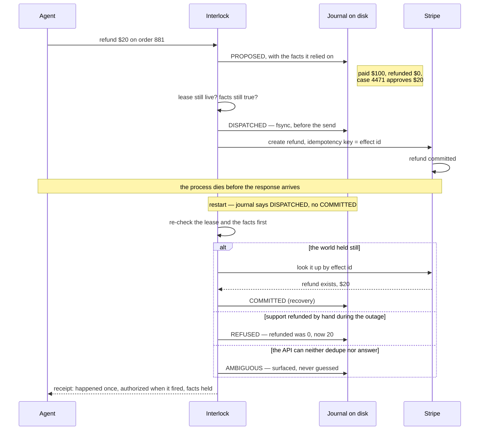
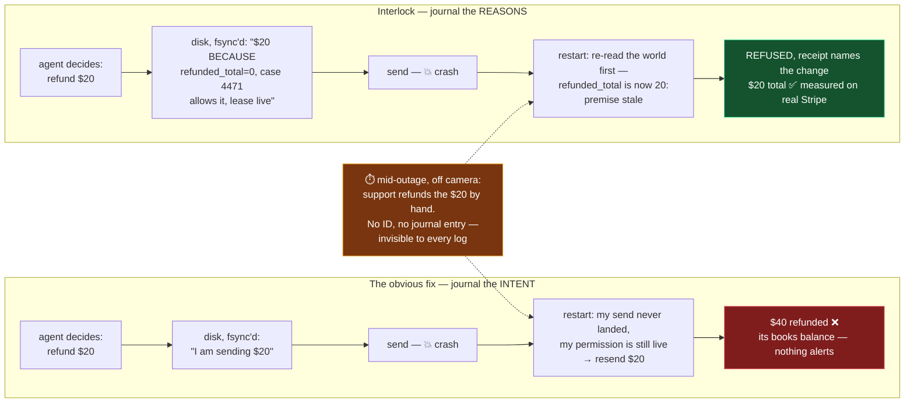
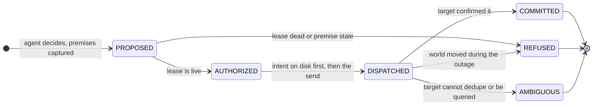

# Interlock

[](https://github.com/az-said/Interlock/actions/workflows/test.yml) · MIT · Python 3.9+ · zero dependencies

**Every action an AI agent takes gets a receipt: it happened once (or is marked unknown when the service can't be asked), it was authorized when it fired, and the facts it was decided on still held when it landed.**

A customer paid $100. A support case approves one $20 partial refund. An AI agent issues it. The service commits the refund; the process dies before the response comes back. On restart, nothing in the system can answer three questions: **did the refund happen? may I retry? was I still allowed to do it?**

Today's answer is a human with two logs and a spreadsheet. Or, worse, the workflow re-runs, the model says "$30" this time, and the customer gets $50. Interlock answers all three questions mechanically, refuses the $30, and is honest about the one case where nobody can know.

```
python3 demo.py naive     # today: the refund lands twice
python3 demo.py 2         # Interlock: lands once, receipt says so
python3 demo.py 3         # Interlock against an API that can't help: refuses to guess
```

The whole system on one screen — the crash, and the three ways recovery can honestly end:



Why the obvious fix isn't enough, in one picture. Both columns write to disk before sending and read it back after the crash — the difference is what the entry carries, because **recovery can only re-check what was written down**:



The journal records what *you* did. It cannot record what the *world* did while you were down. So the entry has to carry the facts the decision stood on — and recovery has to re-read the world before anything is sent a second time. That one line is the difference between the columns of every results table below.

## Seven runs, one claim

| the run | where it ran | what happened | check it |
|---|---|---|---|
| 10 injected refund faults × 6 systems | simulated Stripe-grade API | today's retry pays wrong in 9 of 10; idempotency keys in 5; Temporal-style durable execution in 5; **the gate in 0** | [tables below](#results), regenerated by `run_all.py` |
| the same faults on **real Stripe** | test mode, every id listed | the key pays **$40** when support refunds by hand mid-outage; the gate refuses at recovery | [results/stripe_live.md](results/stripe_live.md) |
| **real Temporal**, workers killed mid-refund | Stripe test mode | 6/7 outcomes as wanted, **7/7 answers matched Stripe's own records**; plain Temporal 4/7 | [results/e2e_live.md](results/e2e_live.md) |
| a **Google ADK** agent under an **AP2 mandate**, SIGKILLed | Stripe test mode | **5/5** as wanted with the gate as the tool callback; 2/5 with an idempotency key alone | [results/adk_live.md](results/adk_live.md) |
| a synthetic approval day, 100 requests | mix stated as an assumption | **65 of 95 cleared with no person**, all 65 receipts verify, **0 wrong payouts** (rules alone: 10 wrong) | [results/approval_inbox.md](results/approval_inbox.md) |
| a real model reading the gate's refusals | 40 cases per system | **0 wrong, 0 sent to a person**; the ungated model paid wrong 15 times | [results/repair_live_model.md](results/repair_live_model.md) |
| the design itself | TLC model checker | **two design flaws found and fixed**, each counterexample kept reproducible in `spec/broken/` | [spec/COUNTEREXAMPLES.md](spec/COUNTEREXAMPLES.md) |

The cost is on the table too: the gate closes a crash in 43s median where a tuned hand-written re-check takes 15s, and that hand-written check ties it on outcomes wherever both ran. Both numbers are ours and published — see [What it costs](#what-it-costs-measured-against-ourselves).

Proof, not promises:

- **Real Stripe.** The refund faults run against Stripe's live test mode; every PaymentIntent id is listed in [results/stripe_live.md](results/stripe_live.md) so the refunds can be checked in the dashboard. Across all live runs, 282 test-mode payments and subscriptions are on the record.
- **Real Temporal.** On a real Temporal dev server, durable execution retries a stale refund to $40, exactly as its own contract says it should. With Interlock as the activity body, the same retry is refused.
- **Real Google ADK.** A live ADK agent holding an AP2 mandate, SIGKILLed mid-refund against Stripe test mode: 5/5 outcomes as wanted with the gate's Guard callback, 2/5 with an idempotency key alone ([results/adk_live.md](results/adk_live.md)).
- **Measured, not argued.** Ten faults and a control against six systems, every simulated cell regenerated by `python3 experiments/run_all.py` in under a second. CI fails if the tables drift from the code.
- **Tested against ourselves.** 415 tests across 40 files, including a 2,000-case randomized fault sweep; 363 passed, 52 skipped, 0 failed on the last full run — the skips are the live-service suites, which need keys. Building and hardening the gate kept turning up bugs in our own code — writing the tests and an adversarial review found 15 real bugs before the escalation build, the three hardening rounds 30 more, the merge review 6 — and each fix has a test that failed before it. The full inventory, with the numbers you can quote, is [tests/README.md](tests/README.md).
- **Model-checked.** The recovery design ran through the TLC model checker ([spec/](spec/)). It found two real flaws — a worker could re-run a completed step behind a stalled lease, and a too-thin dedup window could double-send — both fixed in the code, both counterexamples reproduced by the configs in `spec/broken/` ([spec/COUNTEREXAMPLES.md](spec/COUNTEREXAMPLES.md)).
- **Why now.** Three research groups (Huawei, Tsinghua, WashU) published pieces of this layer between June and September 2026. None re-checks premises on the recovery path; none ships adapters for real services.

> *"The system must distinguish what an agent proposed, what was authorized, what was executed, and what was durably recorded."*
> — the Cloud AI track brief, one sentence in, describing a thing that did not exist. Now it does.

The full narrative — the root, the field, what we ruled out, why it's a business — is in [docs/00-the-whole-story.md](docs/00-the-whole-story.md), as a visual walkthrough at [az-said.github.io/Interlock/docs/interlock-explained.html](https://az-said.github.io/Interlock/docs/interlock-explained.html), or as the landing page that replays the crash live: [az-said.github.io/Interlock/site/index.html](https://az-said.github.io/Interlock/site/index.html).

**The goal: let finance teams cut two thirds of the manual approvals they do on agent actions.** Much of what a reviewer checks is mechanical (is the order still eligible, was it already refunded, is this still allowed), and Interlock checks exactly that at the moment of sending. On a synthetic day of 100 refund requests ([results/approval_inbox.md](results/approval_inbox.md), mix stated as an assumption), rules plus Interlock took reviews from 100 to 36 with zero wrong payouts, where rules alone paid out wrong 10 times. On the fuller accounting, 65 of the 95 unique requests (68.4%) cleared with no person, and all 65 receipts verify.

## What it is

Five rules, one append-only log, Python with no dependencies.

1. **Write the decision to disk before acting.** Every effect gets a `DISPATCHED` entry, fsync'd, before the call goes out. After any crash, "things I started and never confirmed" is a query, not a guess.
2. **The effect's identity is fixed when the request is approved, never by the model.** One approved request → one effect id → at most one committed effect. A model that re-decides "$30" on retry produces the *same* id with a *different* payload, and the gate rejects it. This is why *preserving decision history* and *preventing duplicate effects* are one mechanism, not two.
3. **Actions carry their premises.** Whatever the agent read or assumed when it decided (order is eligible, this function takes one arg) is captured with the proposal and re-checked against the world at commit. If a premise went stale, the effect doesn't land. Optimistic concurrency control, Kung & Robinson 1981, pointed at agents.
4. **Authority is a lease, checked at dispatch.** Not at planning time. Permissions move while agents run.
5. **Recovery never guesses.** It acts by what the target can do: retry if the target dedupes, look up if it can be queried, and otherwise say `AMBIGUOUS` out loud. Before it sends anything a second time, it re-checks the lease and the premises, because the outage is exactly when the world moves.



The output of every effect is a **receipt**: the four facts and a final state. `executed` is what the target confirmed, not what was attempted, so after a crash nobody can resolve it reads `unknown`.

```
    proposed    True
    authorized  True
    executed    True
    recorded    True
    final       COMMITTED
```

That is the object the brief asked for. An auditor reads receipts instead of reconciling logs.

## The core, all the way down

Strip away every adapter, exporter, viewer and experiment, and what is left — the new thing this repo adds — is three decisions, in a small core of Python. This section is the whole invention, in plain language, down to the lines that carry it.

### 1. The action's name is the decision's fingerprint

The moment a request is approved, its identity is computed and never changes:

```python
# interlock/journal.py — effect_id_for()
canonical = json.dumps(key if key is not None else proposal["effect"], sort_keys=True, default=str)
return hashlib.sha256(canonical.encode()).hexdigest()[:12]
```

The effect id is a hash of the approved request. Not a random UUID, not something the model picks. That one choice buys two guarantees with one mechanism:

- **Retry the same decision** → same bytes → same id → the service's dedup and our journal both recognize it. At most one commit per id (invariant I2).
- **The model re-decides "$30" on retry** → same request, different payload → same id, *conflicting* payload. The gate compares the offer against the recorded decision and refuses without sending (invariant I5, `REFUSED:conflicting_payload` — "payload differs from recorded decision").

Everyone treats "remember what was decided" and "don't do it twice" as two systems: an audit log and an idempotency key. Deriving the key *from* the decision makes them the same fact. The dedup key **is** the decision record. That is why a model changing its mind on retry is caught by arithmetic, not by a reviewer.

### 2. One fsync'd line on disk before the world is touched

Immediately before the network call — after the authority and premise checks pass, and recording exactly which checks passed — one line goes to disk and is forced onto the platter:

```python
# interlock/journal.py — append()
f.write(json.dumps(entry) + "\n")
f.flush()
os.fsync(f.fileno())        # durable before we return
```

That line is `DISPATCHED`: *I am about to do this, here is why, under this authority.* The process can now die at any nanosecond, and on restart the question "what did I start and never confirm?" is a file scan, not archaeology across two companies' logs. Every entry also carries the hash of the previous entry for its action (`entry["prev"]`), so the record is a chain: edit an amount, drop an entry, reorder anything, and `verify()` fails. The write-ahead idea is fifty years of database practice; the new part is what's *in* the entry — the premises and the authority, not just the intent — because those are what recovery needs next.

### 3. Recovery is a second dispatch, never a replay

On restart, for every `DISPATCHED` with no `COMMITTED`, `gate._recover_one()` runs this order, and the order is the invention:

1. **Re-check the lease.** Is this *still* allowed, now? Not "was it allowed when we decided" — permissions move while processes are down.
2. **Re-read every premise against the world.** Is "nothing refunded yet" *still true*, now? The outage is precisely when support refunds by hand.
3. **Only then act, by what the target can do:** resend where the service dedupes and only inside its dedup window (tier 1); look the effect up where it can be queried (tier 2); and where the service can do neither, write `AMBIGUOUS` and say so to a person (tier 3) — because "sent, ack lost" and "never sent" are the same observation from our side, and that is the Two Generals result from 1975, not an engineering gap. The gate does not beat the impossibility. It prices it, per service, out loud.

Steps 1 and 2 *before* step 3 is the exact thing missing everywhere else. Temporal, DBOS, Restate and LangGraph replay the recorded decision — deliberately, that is their contract. ATR re-checks premises but excludes crashes. Cordon parks the unclear case but states no per-target guarantee. And it is the thing missing from our own first version: until Finding 4, our `recover()` resent at tiers 1 and 2 without re-checking, and the fault table caught it paying $40. The hardest bug in the system was here too: a recovery running while the original send was still in flight could send twice, so a send now holds a claim that recovery must wait out — that wait is the 43-second median on the live runs, the measured price of never racing yourself.

### Remove any one piece and here is the row that breaks

| remove | what happens | the row that proves it |
|---|---|---|
| identity from the decision (1) | the retry is "a different request"; the re-decided $30 lands; customer gets $50 | table 1, "model re-decides $30 on retry" — every baseline that lacks I5 |
| the fsync'd intent (2) | after a crash you cannot list what you started; you either always retry or never retry, both wrong | table 1, both crash rows |
| the re-check at recovery (3) | the world moved during the outage and the old decision fires anyway: $40 double refund, or a refund under revoked authority | table 1, last three rows — naive, keys, and durable execution all fail them |
| the tier honesty | you claim exactly-once against an email API, which is provably impossible; the failure surfaces as a silent guess | table 1, tier 3 column — `AMBIGUOUS`, never a wrong payment |

That is the entire addition to the world, and it is small on purpose. Receipts, escalations, the inbox, the exporters, the runtime and the adapters are how this core meets the tools people already run. The tables and the 415 tests are the evidence that the core does what this section just said.

## What Interlock combines

Pieces of this exist separately, in durable-execution engines and in papers published this summer. Interlock joins three steps into one system:

1. **Write down why.** Before acting, the premises are saved with the decision: order 881 is eligible, $100 paid, nothing refunded yet. ATR (Huawei, Sept 2026) records premises too, and explicitly leaves crashes out.
2. **Look again after a crash.** Recovery does not resume blindly. It re-reads the journal and re-checks the premises and the lease against the world. If support refunded the order by hand while the agent was down, "nothing refunded yet" is now false, and the retry is refused. Temporal, Restate, DBOS and LangGraph replay the old decision.
3. **Confirm the outcome the way this target allows.** Retry where the service dedupes, and only inside its dedup window. Look it up where it can be queried. Say `AMBIGUOUS` where neither is possible. Cordon (Tsinghua, EuroSys 27) parks unclear effects for a human; nobody states the guarantee per target.

The last three rows of the refund table below are steps 2 and 3, measured.

## See it work

```
$ python3 demo.py 2

  system: INTERLOCK, payments API at tier 2
  customer paid $100. case #4471 approves one $20 partial refund.
  agent decides: refund $20

  ── refund executes, then the process dies before the ack ──
  💥 crash

  ── process restarts ──
  journal says DISPATCHED with no COMMITTED → recovery: COMMITTED_ON_QUERY

  refunded on order #881: $20  (1 refund record(s))

  journal:
    PROPOSED    8351811bed3d
    AUTHORIZED  8351811bed3d
    DISPATCHED  8351811bed3d
    COMMITTED   8351811bed3d  recovery-query
```

Same crash, same agent, against an API that offers neither dedup nor lookup:

```
$ python3 demo.py 3
  ...
  journal says DISPATCHED with no COMMITTED → recovery: AMBIGUOUS
  refunded on order #881: $20  (1 refund record(s))
    final       AMBIGUOUS
```

It refused to retry, so there is no duplicate. It also refused to claim success, because it can't know. That is the whole design philosophy in one row: **never guess, and say exactly what you can't establish.**

### Watch the journal replay

Open `viewer/index.html`. It replays the gate's real journal for every fault as an animated trace: the proposal and its premises, the lease check, the intent written to disk, the crash, what changed during the outage, and how recovery resolved it, with the receipt filling in as it plays. Switch tiers to see the same fault against an API that dedupes, one that can be looked up, and one that can do neither. No server, no build. After changing the gate, regenerate the data with `python3 viewer/build.py`.

Or watch it against the real thing: `python3 demo/serve.py` serves a browser page that runs the same support case side by side, with and without the gate, against Stripe test mode — kill the worker, restart it, watch recovery resolve. Needs a model key and a Stripe test key; [demo/README.md](demo/README.md) has the one-liner. The same page runs on real Temporal retries if `temporalio` is installed.

## Results

Six experiments, one gate, one journal, different worlds. The simulated cells are produced by `python3 experiments/run_all.py` in under a second; the live tables list their own reproduce commands and every Stripe id.

### 1. The refund agent (the brief's own example)

$100 paid, one $20 partial refund approved. Invariant: exactly $20 refunded, or $0 if the lease was revoked or the order became ineligible first. Three baselines: today's naive re-run, the conventional "just use idempotency keys" operation, and durable execution the way Temporal, DBOS and Restate recommend (recorded step results replay, a crashed step re-runs with a stable key, Stripe-grade target).

| fault | naive (today) | idempotency key only | durable execution (Temporal-style) | gate @ tier 1 | gate @ tier 2 | gate @ tier 3 |
|---|---|---|---|---|---|---|
| crash before send | $20 ✅ | $20 ✅ | $20 ✅ | $20 ✅ | $20 ✅ | **$0, `AMBIGUOUS`** ⚠️ |
| crash before ack | **$40** ❌ | $20 ✅ | $20 ✅ | $20 ✅ | $20 ✅ | $20, `AMBIGUOUS` ⚠️ |
| duplicate submit | **$40** ❌ | $20 ✅ | $20 ✅ | $20 ✅ | $20 ✅ | $20 ✅ |
| model re-decides $30 on retry | **$50** ❌ | $20 ✅ | $20, replayed ✅ | $20, refused ✅ | $20, refused ✅ | $20, refused ✅ |
| same request, different amount | **$50** ❌ | $20 ✅ | $20, replayed ✅ | refused ✅ | refused ✅ | refused ✅ |
| lease revoked mid-flight | refunded ❌ | **refunded** ❌ | **refunded** ❌ | refused ✅ | refused ✅ | refused ✅ |
| order became ineligible | refunded ❌ | **refunded** ❌ | **refunded** ❌ | refused ✅ | refused ✅ | refused ✅ |
| support refunds by hand during the outage | **$40** ❌ | **$40** ❌ | **$40** ❌ | $20, refused at recovery ✅ | $20, refused at recovery ✅ | $20, `AMBIGUOUS` ⚠️ |
| lease revoked during the outage | refunded ❌ | **refunded** ❌ | **refunded** ❌ | refused at recovery ✅ | refused at recovery ✅ | $0, `AMBIGUOUS` ⚠️ |
| recovery after the 24h idempotency window | **$40** ❌ | **$40** ❌ | **$40** ❌ | $20, found by lookup ✅ | $20, found by lookup ✅ | $20, `AMBIGUOUS` ⚠️ |

**Finding 1. Exactly-once is a property of the target, not the client.** Achievable when the API dedupes (tier 1) or can be queried (tier 2). When it does neither, the crash cases are undecidable from the client: "sent, ack lost" and "never sent" produce identical observations. The strongest honest guarantee at tier 3 is *at-most-once plus a surfaced ambiguity*, and the cost is on the table: a refund that **never happened** stays blocked after a crash-before-send. This is the Two Generals result (1975) written as a per-service contract with a measured price.

**Finding 2. Idempotency keys are necessary and not sufficient.** The idempotency-only column handles crashes, duplicates, and the $30 re-decision, all at the service. It still refunds under a revoked lease and refunds an ineligible order, because the service can't see the agent's authority or premises. The difference between that column and the gate columns is what the runtime adds, measured rather than claimed.

**Finding 4 (added after checkpoint 2). Recovery is when the world moves.** The last three rows found a bug in our own gate. Until this change, `recover()` re-sent at tiers 1 and 2 without re-checking premises or lease, so the gate refunded $40 when support refunded the order by hand during the outage, and refunded under a lease revoked during the outage. Tier 1 also trusted the provider's dedup forever, but Stripe prunes idempotency keys after 24 hours, and a retry after that is a new refund. The fix: a resend is a new dispatch, so I3 and I4 run again first, and after the dedup window tier 1 is treated as a lookup, not a safe retry. The idempotency-only column still fails all three, because a key only matches the same request.

### 2. Parallel coding agents (the same root, wearing a different hat)

Two agents on one repo. Agent B decides first, agent A lands first. That ordering is what every worktree-based product ships. Invariant: nothing lands that fails at runtime; nothing lands twice; one implementation per symbol.

| fault | naive (today) | gate, file-hash premises | gate, symbol premises |
|---|---|---|---|
| A renames the function B calls | lands, **breaks at runtime** ❌ | refused ✅ | refused ✅ |
| A and B both implement `format_currency` | **2 implementations** ❌ | 1, B told A holds it ✅ | 1 ✅ |
| A edits the file in a way B doesn't depend on | lands ✅ | **refused** ⚠️ | lands ✅ |
| crash after apply, before commit | **duplicated** ❌ | recovered ✅ | recovered ✅ |
| duplicate submit | **duplicated** ❌ | ignored ✅ | ignored ✅ |
| lease revoked | lands ❌ | refused ✅ | refused ✅ |
| A keeps name+arity, inverts meaning | lands, **breaks** ❌ | refused ✅ | lands, **breaks** ❌ |

**Finding 3. Premise granularity is a dial with a floor.** File-hash premises never land a broken change but refuse benign concurrent edits: that's the naive "did the file change" check every worktree tool could add, and it over-fires. Symbol premises (what the agent actually *referenced*, not what it *opened*) land benign edits, catch the rename, and catch duplicated work with zero model calls. Duplicated work is the single most common multi-agent failure mode in the Berkeley MAST study (17% of 1,600 traces). But symbol premises cannot see a change that keeps the signature and inverts the meaning. No mechanically extractable premise catches that row. Catching it requires understanding intent, which is a model-quality question, and the brief is explicit that protocol guarantees and model quality stay separate. That row is the measured boundary.

The thesis behind this half, from the team's concurrency-control spec: **agent transactions need concurrency control, but not the classical kind.** Abort-and-retry assumes a cheap, deterministic redo. LLM agents cost 4–15× tokens per attempt and don't reproduce their plan on re-run. So the gate's response to a conflict is graded by what it can say mechanically, not "abort everything."

### 3. The same faults against real Stripe

Not a simulation: `experiments/stripe_live.py` makes a $100 test-mode card payment per run, approves one $20 partial refund, and injects the fault against Stripe's API. Every payment id is listed in [results/stripe_live.md](results/stripe_live.md) so the refunds can be checked in the Stripe test dashboard.

| fault | naive (today) | idempotency key only | gate (Stripe key + lookup) |
|---|---|---|---|
| crash before ack | **$40** ❌ | $20 ✅ | $20 ✅ |
| duplicate submit | **$40** ❌ | $20 ✅ | $20 ✅ |
| support refunds by hand during the outage | **$40** ❌ | **$40** ❌ | $20, refused at recovery ✅ |

Same result as the simulation, on the real service: the idempotency key handles the crash and the duplicate, and pays twice when a person refunds during the outage.

### 4. Durable execution on a real Temporal server

Not modeled: `experiments/temporal_live.py` runs the refund step as a Temporal activity on Temporal's local dev server, with Temporal's own retry policy doing every retry. A worker crash is a failed first attempt. Full output in [results/temporal_live.md](results/temporal_live.md).

| fault | Temporal, recommended idempotency key | Temporal with Interlock as the activity body |
|---|---|---|
| crash before ack | $20 ✅ | $20 ✅ |
| support refunds by hand during the outage | **$40** ❌ | $20, refused at recovery ✅ |
| permission revoked during the outage | **refunded** ❌ | refused at recovery ✅ |
| order became ineligible before the step ran | **refunded** ❌ | refused ✅ |

Temporal does exactly what it promises: the crashed step is retried and, with a stable key, lands once. When the facts behind the decision changed before the retry, it runs the same step again. Put the gate inside the activity and the same retry is refused. Interlock is not a Temporal replacement; it is the activity body. `interlock.temporal.gated()` is that body, and experiment 4 uses it.

The longer end-to-end run — a real model deciding, real Stripe, real Temporal, workers killed mid-step, seven support cases — is in [results/e2e_live.md](results/e2e_live.md): with the gate as the activity body, 6/7 outcomes as wanted and 7/7 final answers matched Stripe's own records, at a median 43 seconds from crash to close. Plain Temporal with the recommended key got 4/7.

### 5. A Google ADK agent under an AP2 mandate, live

Not our harness alone: `experiments/adk_live.py` runs a Google ADK agent holding an AP2 payment mandate, kills the process with SIGKILL mid-refund, and restarts it against Stripe test mode. An AP2 mandate says what the agent may spend; the gate's Guard callback is what makes that hold across a crash — a journaled intent before the POST, the mandate re-verified and the premises re-checked at dispatch and again on recovery. With the Guard, 5/5 runs left Stripe exactly as wanted. An idempotency key alone got 2/5. Full table and reproduce command in [results/adk_live.md](results/adk_live.md).

### 6. How many approvals still need a person

`experiments/approval_inbox.py` runs one synthetic day of 100 refund requests three ways. **The mix is an assumption, not measured data** (60 routine, 15 over the $50 limit, 5 flagged customers, 5 ineligible orders, 5 duplicate deliveries, 5 crashes mid-send, 5 refunded by hand before the agent's send, and, of the over-limit requests, 3 refunded in full and 2 refunded a third by hand between approval and send). Change it and re-run.

| system | reviews a person did | orders refunded the wrong amount |
|---|---|---|
| everyone approves | 100 | **10** |
| rules only (routine requests send with an idempotency key) | 25 | **10** |
| rules + Interlock (`interlock/approvals.py`) | 36 | 0 |

Rules take routine work off people, but without the gate they pay out wrong whenever the facts changed between the decision, or the approval, and the send. With the gate, a person's approval is the authority the refund runs under, and the facts they saw are its premises: a stale, expired, or unauthorized approval is refused when the refund is actually sent, and comes back to the queue saying what changed. Of the 11 extra reviews, 10 are people closing or repairing refunds the gate stopped, not re-deciding them, and 1 is a person deciding the new, smaller amount of an accepted repair.

### What it costs, measured against ourselves

The gate is slower on recovery: 43s median crash-to-close on the Temporal harness against 15s for a tuned hand-written re-check, and 46s against 10s on the ADK harness. The claim-TTL wait is the price of never resending while another worker might still be mid-send. And a careful hand-written check — an idempotency key, a lookup, a premise re-read, 6 to 10 lines per tool — ties the gate on outcomes everywhere both ran. Both numbers are ours and published: [docs/11-weakness-audit.md](docs/11-weakness-audit.md), [docs/11-quality-plan.md](docs/11-quality-plan.md), and the eight live-service scenario harnesses in [docs/10-scenarios.md](docs/10-scenarios.md).

What the gate adds over that hand check: no per-tool code, one journal and one receipt format across every tool, `AMBIGUOUS` instead of a guess where the API can't answer, and a refusal a model actually acts on. In the live-model run, the gate's refusals were read and correctly repaired in all 10 refused cases; the hand check's message left the customer short in 4 of its 6 hand-refund cases.

## Why this and not the obvious things

**"Just use idempotency keys."** That's the second column in table 1, and it's the right answer whenever the target supports it. It refunds the ineligible order anyway. Keys live at the service; authority and premises live at the agent. Both are needed.

**"Just log more."** A log records what the logger saw. The thing you need to know happened on a machine you don't control, and it can only tell you by sending a message, which is subject to the same loss. Perfect client-side logging of the crash above reads `request bytes written` and then nothing. Logging is observation. What's missing is *attribution*: which decision, under whose authority, produced which effect, once. Enterprises report having the first without the second.

**"Temporal / Pydantic AI already does this."** Durable execution wraps every model and tool call as a checkpointed step and resumes from the last completed one. That solves resume and freezes model outputs. It checkpoints the step's *result*, which means a tool step that dies after the effect and before the result is saved re-runs the tool. Whether that duplicates the effect is the tool's problem. Their docs say as much: if the process crashes mid-request, the agent has no idea what already happened. Interlock is the body of that step. It journals intent *before* the call, checks premises and lease at dispatch, and recovers by the tool's tier. Complementary, and the cleanest place to ship it. Table 1's third column measures the difference instead of arguing it: durable execution used the way Temporal recommends, against a Stripe-grade target, ties the gate on every crash, duplicate, and re-decision row, and fails all five rows where the world changed after the decision. Experiment 4 repeats the key rows on a real Temporal server, with the same result.

**"Keep writes single-threaded" (Cognition).** Sufficient for coherence, not necessary. It's the rule a database would impose with no concurrency control, and databases abandoned it for throughput. The benign-edit row is a concurrent write landing safely.

**"CaMeL solves prompt injection with capabilities."** Yes, and it was the closest prior work until this summer. CaMeL controls whether untrusted data can influence control flow. It has no model of crashes, retries, duplicate delivery, or revocation. It answers "was this action allowed?" Interlock answers "did this allowed action happen, once, under authority that was live when it fired?"

**"Didn't a paper just do this?"** Three did, in pieces, between June and September 2026. ATR (Huawei) re-checks typed premises but excludes crashes and non-idempotent APIs. Cordon (Tsinghua, EuroSys 27) stages effects and parks an unproven dispatch in an audit state, which is our tier 3 from the security side. "Engineering Reliable Commit Gates for Agentic AI" (WashU) benchmarks verifiers and shows after-check races need atomic guards. None re-checks premises on the recovery path or states a guarantee per target, and none ships adapters for real services. Three groups converging on this layer in three months is the best evidence the layer is real. Details in [docs/03-landscape.md](docs/03-landscape.md#research-published-this-summer).

Full landscape, with the tools attacking parallel-agent conflicts today, in [docs/03-landscape.md](docs/03-landscape.md).

## Add it in three lines

For your own functions, skip the adapter. Three statements: create the gate, decorate the function that has the side effect, recover on startup.

```python
from interlock import Interlock
gate = Interlock(".interlock")

@gate.effect(key=lambda order, amount: f"refund:{order}",
             premises=lambda order, amount, idempotency_key: {
                 "eligible": is_eligible(order),
                 "refunded_by_others": refunded_total(order, excluding=idempotency_key)},
             dedupes=True)
def refund(order, amount, idempotency_key):
    return stripe.Refund.create(charge=charge_for(order), amount=amount, idempotency_key=idempotency_key)

gate.recover()   # once, on startup
```

`refund("881", 20)` now journals the decision, re-reads the premises right before the call and again after any crash, passes a stable idempotency key, and returns `("COMMITTED", result)`, `("REFUSED:stale_premise", None)`, `("DUPLICATE_IGNORED", ...)`, and so on.

If startup happens before a crashed sender's claim expires, calling the decorated function again retries recovery of its recorded decision. Call `recover()` periodically for effects that will not be called again. An active claim still prevents a second send.

The one thing you still have to say is the thing no library can guess: which facts the decision depends on. Then say how the service cooperates: `dedupes=True` if it takes the key, `lookup=` a function that answers "did this already happen?", or neither. `allowed=` adds a permission check at dispatch and at recovery. A premise that would count the effect's own result takes `idempotency_key` and leaves it out, as above. The adapter is `interlock/easy.py`; `tests/test_interlock.py` runs it through a crash and a process restart.

## Zero lines: in front of an MCP server

The agent's code doesn't change. Point its MCP server command at the proxy and name the tools that have real effects:

```
python3 -m interlock.mcp_proxy --config interlock.mcp.json -- python3 payments_server.py
```

```json
{"tools": {"create_refund": {
  "key": ["order_id"],
  "premises": {"tool": "get_order", "arguments": {"order_id": "order_id"}, "fields": ["refunded_total"]},
  "lookup": {"tool": "find_refund", "arguments": {"reference": "$effect_id"}, "found": "found"},
  "idempotency_argument": "reference"}}}
```

Every other message passes through untouched. `create_refund` is journaled before it goes out, its facts are read from `get_order` and read again before any resend, a crash is recovered on the next start, and the tool result carries the receipt in `_meta.interlock`. MCP itself has no idempotency or transactional contract; this is where a tool gets one. `tests/test_mcp_proxy.py` runs it against a real subprocess MCP server, kills the proxy mid-call, and checks the refund lands once, and that a refund issued by hand during the outage is refused even when the agent retries.

Premise tools must return every configured field, and lookup tools must return a JSON boolean in the configured `found` field. An error, missing field, or malformed lookup leaves the action unsent or unresolved; it never proves that the previous action was absent.

The same config drives in-process tool lists, for any loop that maps a tool name to a function:

```python
from interlock.tools import protect
tools = protect({"get_order": get_order, "create_refund": create_refund, "find_refund": find_refund}, config)
tools.recover()                                   # once, on startup
out = tools["create_refund"](order_id="881", amount=20)
# hand out["message"] back to the model as the tool result
```

For LangChain or LangGraph, `interlock.langchain_tools.protect_tools(tools, config)` takes and returns `BaseTool` objects, so the list drops into `create_agent` or a `ToolNode` unchanged (`tests/test_langchain.py`, run with `uv run --with langchain-core --with langgraph`).

When the agent reads the premises tool itself (`get_order`, through the proxy or the tool list), its call is proposed on the facts it read, not on a fresh read at call time. A refund issued by hand between the agent's read and its call is caught too.

## Refused, then repaired

A refusal says what changed, not just that something did: `Interlock did not send this action (REFUSED:stale_premise): ... refunded_total: was 0, now 5.` The same facts are in `out["repair"]` and in the MCP result's `_meta.interlock.repair`; the structured form is `_meta.interlock.escalation` (see [Escalations and receipts](#escalations-and-receipts)).

By default a refused request stays refused until a person decides again, because a model that re-decides on retry is how a $20 refund becomes $50. Add an `approval` to the tool's config and the agent may send a corrected call instead:

```json
"approval": {"tool": "get_approval", "arguments": {"order_id": "order_id"}, "attempts": 3}
```

The tool returns the approval from the system of record, never from the model: `{"id": "case-4471", "match": {"order_id": "881"}, "max": {"amount": 15}}`, where `max` is what is still left. Each distinct decision is its own attempt. A call that fits the approval is sent, and only one attempt per approval is ever sent, so a crash can't be routed around with a new amount. A call outside it is refused with the limit (`amount 30 is over the 15 approved`). `attempts` (optional) caps the distinct calls tried, so a model that keeps re-deciding is stopped by the gate. An expired, revoked, used-up or already-used approval says `may_retry: false`. The store is `approvals.Envelope`; the decorator takes `approval=` and `attempts=` too.

Repair means one thing in both places: a new effect id, never the refused one with a different payload. Here the agent picks the new payload and the approval bounds it; in the inbox (`Inbox.repair`) a person accepts a suggested one and it goes back through rules or a person.

On a synthetic day of 100 refunds ([results/repair_loop.md](results/repair_loop.md), mix stated as an assumption, scripted agent rather than a model), the refunds that needed a person went from 17 to 3 and wrong payouts from 13 to 0. The 13 were $30 decisions on $20 cases, which premises alone don't bound. With no gate, 40 of 100 paid out wrong. A careful hand-written check for this one refund (a reference per case, a lookup, a read of what is left right before sending) ties Interlock with repair on that day, as it did in [docs/10-scenarios.md](docs/10-scenarios.md). What Interlock adds there is no per-tool code and a record of which checks ran.

With a real model deciding ([results/repair_live_model.md](results/repair_live_model.md): `gpt-5.4-mini` over Azure OpenAI, 40 cases per system, mix stated as an assumption), interlock+repair finished all 40 with no person and no wrong payout, and in all 10 refused cases the model read the refusal and sent the right corrected call. No gate paid out wrong 15 times ($233). The hand check paid nothing wrong, but in 4 of its 6 hand-refund cases the model read "Not sent: amount 20 is over the 11 left on this case. You may send a refund of up to 11." and replied DONE with the customer short, and 2 went to a person. A first run with a terser hand-check message did worse ([results/repair_live_model_terse_hand_check.md](results/repair_live_model_terse_hand_check.md)). That gap is the refusal message, not the check: Interlock's tells the model what changed and what to do next, for every tool, and a hand check has to be written to do the same. The model never asked for more than the $20 approved, so the approval limit was exercised only by the scripted run. Six cases per kind is a small sample.

## Receipts you can check

A log you have to trust is not a receipt. Every journal entry is hash-chained to the previous entry for its action, every send records the lease and premise checks that passed immediately before it, and `verify()` re-derives the claims from those entries alone:

```
$ interlock-verify receipt.json --key $SHARED_KEY
{ "valid": true, "tamper_evident": true, "signed": true,
  "happened": true, "happened_once": true,
  "authorized_when_fired": true, "assumptions_held": true, "problems": [] }
```

`gate.receipt_bundle(proposal, key)` produces the file. With a key shared with the other side (the payment service, an auditor), the bundle is HMAC-signed, so both sides can confirm the same record of what happened; an edited amount, a removed entry, or a rewritten chain fails. After a crash nobody can resolve, the receipt says `happened: "unknown"` instead of guessing. Without a key, the chain proves internal consistency only, and `verify()` says `signed: null`.

## Escalations and receipts

The goal is to cut two thirds of the manual approvals finance teams do on agent actions. That only works if what still reaches a person is explained, routed, and on the record.

**Explained.** A refusal says exactly what changed and what would still be safe. A $50 refund on a $100 order, after support refunded $30 by hand, comes back as `changes: [{"field": "refunded", "was": 0, "now": 30}]`, read as `refunded: was 0, now 30`, with the repair `still_fits` (70 is left to refund). A $100 request after the same hand refund suggests `refund_remaining`, `{"amount": 70}`. Targets opt in with an optional `explain()` method; targets without it keep refusing with plain strings. The same structure rides on the MCP proxy refusal (`_meta.interlock.escalation`, next to the agent's guidance in `_meta.interlock.repair`), on `tools.protect()` results (`out["escalation"]`) and on the Temporal helper's error. A repair is a new decision: a new effect id, never the refused one with a different payload, back through the rules or a person, and superseded if the facts moved again.

**Routed, with an SLA.** `Route("large", ["controller", "finance-manager"], when=..., sla=4 * 3600)` sends an escalation to a group; only a member of that group, checked when deciding and again at the send, can approve it. Unanswered past its SLA, it moves up the chain. An approval that expires, or whose approver left the group, is refused at the send and re-escalated with freshly read facts. Time is injected (`clock=`), and the queue is a fold over the journal, so a restarted or second inbox rebuilds it without losing or duplicating an escalation.

**On the chain.** `ESCALATED` (reason, what changed, facts shown, the group and its members) and `DECIDED` (who, when, on which escalation) are appended to the effect's hash chain, atomically with the dispatch check. `verify()` checks that a person's send has that person's decision, on the latest escalation, on the facts they were shown, before the send, from someone it was routed to, and reports `approved_by`, `approval_verified` and the `escalations` history. Receipts from before this feature stay valid.

**Confirmed by the target.** `interlock.confirm.confirm_event()` takes a Stripe webhook, verifies its `Stripe-Signature` (HMAC-SHA256 over `t.payload`, a timestamp tolerance, constant-time compare), matches the refund to the effect by `metadata.interlock_effect_id`, and appends `CONFIRMED` with the event and refund ids. `confirm_by_lookup()` does the same from the refunds list for users without webhooks. Unsigned or mismatched events write nothing. `verify()` then reports `confirmed_by_target`.

**Exported.** Receipts export to Cloud Logging and BigQuery (both read back live in the tests), OpenTelemetry spans, and SIEM file formats (`interlock/export/`). Which receipt field answers which SOX, SOC 2, PCI DSS and NIST AI RMF question is mapped in [docs/08-compliance-mapping.md](docs/08-compliance-mapping.md) — the mapping is evidence, not certification.

**Counted.** `interlock.scoreboard.scoreboard(journal)` derives the numbers from the journal alone: requests, cleared with no person (and how many of those receipts verify), escalations by reason, stale approvals caught, crash cases sent to a person, repairs suggested and accepted, SLA breaches, time to decision. Experiment 6 reports it on its synthetic day.

## Install

```
pip install git+https://github.com/az-said/Interlock      # no dependencies; Python 3.9+
pip install "interlock-gate[temporal] @ git+https://github.com/az-said/Interlock"   # plus temporalio
```

A journal path ending in `.db` uses SQLite, so several workers can share one journal: an action is dispatched by exactly one of them and recovered by exactly one of them (`tests/test_interlock.py`, eight workers racing).

## Where it plugs in

Interlock is a wrapper around the point where an agent calls a tool. It does not touch the model, the prompt, or the agent framework's planning loop.

```mermaid
flowchart LR
    subgraph agents ["your agent stack, unchanged"]
        MCP["MCP server, proxied"]
        LC["LangChain / LangGraph tools"]
        ADK["Google ADK + AP2"]
        TMP["Temporal activity body"]
        PY["plain Python function"]
    end
    subgraph gate ["Interlock"]
        J["journal: intent on disk before the send, hash-chained"]
        L["leases: authority checked at dispatch and at recovery"]
        P["premises: facts re-checked when the action actually lands"]
    end
    subgraph target ["the service, by what it can do"]
        T1["tier 1: dedupes — retry is safe inside the window"]
        T2["tier 2: can be queried — recovery looks it up"]
        T3["tier 3: neither — AMBIGUOUS, out loud"]
    end
    R["receipt per effect: happened once, authorized, premises held"]
    EXP["exports: BigQuery, Cloud Logging, OpenTelemetry, SIEM"]
    agents --> gate
    gate --> target
    gate --> R
    R --> EXP
```



```python
gate = Gate(target=StripeTarget(client), journal_path="~/.interlock/journal.jsonl", leases=leases)
result = gate.submit({"agent": "refund-bot", "lease": lease_id,
                      "premises": target.capture(order_id),
                      "effect": {"order": order_id, "amount": amount}})
```

An `EffectTarget` is an adapter with four methods: `capture` premises, `validate_premises`, `apply`, and optionally `query`. It declares its tier. Writing one for a real service is an afternoon:

| target | tier | how |
|---|---|---|
| Stripe | 1 | `Idempotency-Key: <effect_id>` header; Stripe dedupes for 24h |
| GitHub merge | 2 | look up the merge commit by branch SHA on recovery |
| Postgres write | 2 | `INSERT ... ON CONFLICT` keyed on effect id, or a lookup |
| SendGrid / most email | 3 | no dedup, no lookup: `AMBIGUOUS` on crash, surfaced for reconciliation |
| Natural, agent-native rails | 1 | receipt-bearing ledger; the cooperating side, being built now |

If you don't run Temporal, the repo also carries `runtime/`: a durable workflow runtime on Postgres alone (about 900 lines, one dependency), with the gate's dispatch-and-commit transactions and tiered recovery built into the step primitive, and its recovery design model-checked in [spec/](spec/). It is not the pitch; it is the proof that the gate's contract fits any runtime — [docs/07-runtime.md](docs/07-runtime.md).

Integration sketch for LangGraph, MCP, and the OpenAI Agents SDK in [docs/04-integration.md](docs/04-integration.md).

## Who this is for

The platform engineer who gets paged when an agent double-fires. The team running coding agents in parallel and finding green builds that don't run. The finance team about to let an agent touch refunds and being told by compliance that "we have logs" is not an answer to "who authorized this."

Reconciliation is already the most expensive manual process in corporate finance. Agent-originated actions are about to multiply the volume that needs reconciling. A receipt per effect is cheaper than a human per incident.

## What's real, what's not

**Real.** The journal, the gate, the targets, every experiment and every number above. `python3 experiments/run_all.py` regenerates the simulated `results/` from scratch in under a second; each live table carries its own reproduce command.

**Tested.** `python3 -m unittest discover -s tests` — 415 tests in 40 files, 363 passed and 52 skipped on the last full run (the skips are the live-service suites, which need keys), 0 failed; CI on Python 3.9, 3.12 and 3.13 on every push, failing if `results/` drifts from the code. The suite asserts every row above, where each baseline fails as well as where the gate holds; runs 2,000 randomized interleavings of tier, crash point, events before the decision and during the outage, late recovery, and duplicate delivery; races eight workers on one journal (JSONL and SQLite) to prove one dispatch and one recovery; tampers with receipts; runs the approval inbox through stale, expired, and unauthorized approvals; runs the three-line integration through a simulated restart; and kills the MCP proxy mid-call against a real subprocess server. Building and hardening the gate found real bugs in our own code at every stage — 15 before the escalation build, 30 more across three adversarial hardening rounds, 6 in the merge review — and each fix has a test in `tests/` that failed before it. The worst was critical: a recovery running while a send was still being applied could send it a second time; sends now hold a claim that recovery waits out. The full inventory is [tests/README.md](tests/README.md).

**Model-checked.** The recovery design is a TLA+ model in [spec/](spec/), checked with TLC for the stated constants — a model check, not a proof of the Python or the SQL. It found two design flaws before any test did, both fixed in the code, and every counterexample is kept reproducible by the configs in `spec/broken/` ([spec/COUNTEREXAMPLES.md](spec/COUNTEREXAMPLES.md)).

**Simulated.** The payments API and the repo in tables 1 and 2 are local. Faults are injected, not observed. This is by design: the brief asks for targeted failures at meaningful boundaries, not random process kills.

**Real, against live services.** `interlock/targets/stripe_api.py` is a Stripe refunds target (test-mode keys only, standard library only); experiments 3, 4 and 5 run against real Stripe, a real Temporal server, and a real Google ADK agent, and the eight scenario harnesses in `scenarios/` cover payouts, disputes, billing credits, calendar, email, GCP resources, GitHub merges and a shared spending cap.

**Not built yet.** A real GitHub merge target in the gate itself. Premise extraction beyond file hashes and function arity. A notary that both sides write to, so tier 3 services can be lifted to tier 2 without changing their API.

**Out of scope, on purpose.** Whether the agent's decision was *right*. A faithfully executed bad refund is still a bad refund. Interlock controls effects, not judgment.

## Next test

Swap `LocalRepo` for a real `gh pr merge` target and measure how often the gate must return `AMBIGUOUS` when the merge API response is dropped, versus when GitHub's merge-commit lookup is used as the tier-2 query. The ratio is the availability cost of running without a cooperating target.

## Repo map

```
interlock/           the gate
  journal.py         append-only and hash-chained, JSONL or shared SQLite; effect_id_for() binds identity to the approved request
  leases.py          authority that expires and is checked at dispatch
  gate.py            eight invariants, recovery by tier, claims registry, three baselines
  easy.py            the three-line decorator: Interlock(dir), @gate.effect(...), gate.recover()
  approvals.py       rules, routes with SLAs, a queue rebuilt from the journal, approvals as authority re-checked at send time, Envelope for repair
  escalation.py      shapes for escalations, decisions and confirmations; what changed and safe repairs
  confirm.py         Stripe webhook signature check and refund lookup, appended as CONFIRMED
  scoreboard.py      approval stats derived from the journal
  receipts.py        receipt bundles and verify(): happened once, authorized, assumptions held, who decided, target confirmed
  mcp_proxy.py       zero-line integration in front of any MCP server
  tools.py           protect() for in-process tool lists, and the refusal-and-repair message both share
  langchain_tools.py protect_tools() for LangChain and LangGraph BaseTool lists
  temporal.py        gated(): the gate as a Temporal activity body
  export/            receipts to BigQuery, Cloud Logging, OpenTelemetry and SIEM formats
  integrations/      the Google ADK Guard callback and AP2 mandate checks
  targets/
    payments.py      simulated refund API at tiers 1 / 2 / 3, Stripe-style key semantics
    repo.py          local code repo with file-hash and symbol premises
    stripe_api.py    real Stripe refunds, test-mode keys, standard library only
runtime/             durable workflow runtime on Postgres alone; the gate's contract as a step primitive (docs/07-runtime.md)
spec/                TLA+ model of the recovery design; broken/ reproduces every counterexample TLC found
scenarios/           eight live-service scenario harnesses behind docs/10-scenarios.md
experiments/         the fault-injection harnesses; run_all.py writes results/
results/             the tables above, as markdown and json, live runs with every Stripe id
viewer/              index.html replays real journals as an animated trace; build.py writes traces.js
demo/                browser side-by-side: the same crash with and without the gate, live
tests/               every README claim as an assertion, a 2,000-case fault sweep, the decorator through a restart
docs/
  00-the-whole-story.md      the narrative: root → decisions → field → business
  interlock-explained.html   the same story as an interactive page
  01-problem.md      the root, from three lines of code to the four facts
  02-contract.md     invariants, failure model, cooperation ladder, baselines
  03-landscape.md    who owns which layer; the positions we disagree with
  04-integration.md  the EffectTarget adapter; LangGraph / MCP / Temporal; the notary
  05-reading.md      what we read and what each paper hands you
  07-runtime.md      the Postgres runtime, and what it borrows from Temporal, DBOS and Restate
  10-scenarios.md    the eight live scenarios, per-scenario commands and outcomes
  checkpoints/       what was submitted, what was scored, what changed
demo.py              one refund, one crash, one receipt
```

## How this came together

Saturday we wrote two specs that looked like different projects: one refund, at most once, and concurrency control for parallel coding agents. Sunday morning we noticed they were the same mechanism pointed at two targets, built the core once, and ran both.

## Who built it

| | |
|---|---|
| **Said Azaizah** | [said-azaizah.vercel.app](https://said-azaizah.vercel.app) · [github.com/az-said](https://github.com/az-said) |
| **Kiro Moussa** | [kiro.city](https://kiro.city) · [https://github.com/kiromoussa](https://github.com/kiromoussa) |

## References

The ones the results lean on. The full list with notes is in `docs/05-reading.md`.

- Akkoyunlu, Ekanadham & Huber (1975). Two Generals. Why tier 3 is undecidable.
- Kung & Robinson (1981). Optimistic concurrency control. The premise check.
- Garcia-Molina & Salem (1987). Sagas. The next step after this repo.
- Leach, Stripe (2017). Idempotency keys. The second baseline.
- Cemri et al. (2025). Why Do Multi-Agent LLM Systems Fail? arXiv 2503.13657. Step repetition at 17.14%.
- Debenedetti et al. (2025). CaMeL. arXiv 2503.18813. Closest prior work before this summer; no failure model.
- Lyu et al. (2026). ATR: selective revalidation for long-running AI agents. arXiv 2609.08015. Premises, without crashes.
- Chen et al. (2026). Cordon: semantic transactions for tool-using LLM agents. arXiv 2606.17573. Staged effects; tier 3 from the security side.
- Zheng et al. (2026). Engineering Reliable Commit Gates for Agentic AI. arXiv 2609.10969. Why the premise check sits immediately before dispatch.
- Cognition. Don't Build Multi-Agents. The position the benign-edit row answers.
- Mosaic (2026). The Coordination Problem. The "retry is free" assumption the coding half disputes.
- Anthropic (2025). How we built our multi-agent research system. The 4×/15× token figures.

Interlock — Battle of the Coasts 2026, Cloud AI track, Boston. MIT licensed. Fork it, break it, tell us which row is wrong.
