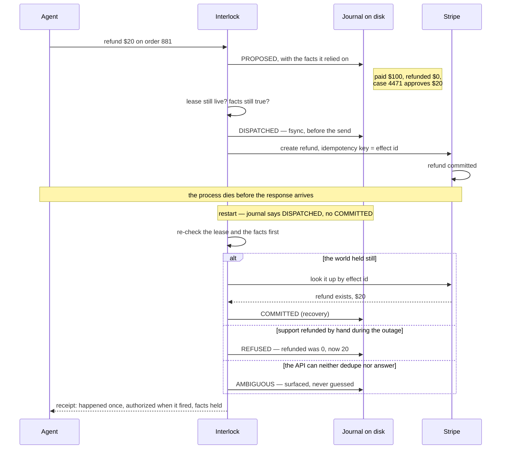
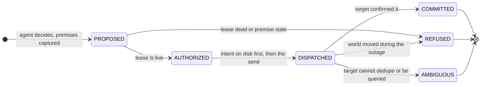

# How Interlock works

The problem, the five rules, the core in code, and where it plugs in. Back to the [README](../README.md).

## The problem

A customer paid $100. A support case approves one $20 partial refund. An AI agent issues it. The service commits the refund; the process dies before the response comes back. On restart, nothing in the system can answer three questions: **did the refund happen? may I retry? was I still allowed to do it?**

Today's answer is a human with two logs and a spreadsheet. Or, worse, the workflow re-runs, the model says "$30" this time, and the customer gets $50. Interlock answers all three questions mechanically, refuses the $30, and is honest about the one case where nobody can know.

```
python3 demo.py naive     # today: the refund lands twice
python3 demo.py 2         # Interlock: lands once, receipt says so
python3 demo.py 3         # Interlock against an API that can't help: refuses to guess
```

The whole system on one screen — the crash, and the three ways recovery can honestly end:



## What it is

Five rules, one append-only log, Python with no dependencies.

1. **Write the decision to disk before acting.** Every effect gets a `DISPATCHED` entry, fsync'd, before the call goes out. After any crash, "things I started and never confirmed" is a query, not a guess.
2. **The effect's identity is fixed when the request is approved, never by the model.** One approved request → one effect id → at most one committed effect. A model that re-decides "$30" on retry produces the *same* id with a *different* payload, and the gate rejects it. This is why *preserving decision history* and *preventing duplicate effects* are one mechanism, not two.
3. **Actions carry their premises.** Whatever the agent read or assumed when it decided (order is eligible, this function takes one arg) is captured with the proposal and re-checked against the world at commit. If a premise went stale, the effect doesn't land. Optimistic concurrency control, Kung & Robinson 1981, pointed at agents.
4. **Authority is a lease, checked at dispatch.** Not at planning time. Permissions move while agents run.
5. **Recovery never guesses.** It acts by what the target can do: retry if the target dedupes, look up if it can be queried, and otherwise say `AMBIGUOUS` out loud. Before it sends anything a second time, it re-checks the lease and the premises, because the outage is exactly when the world moves.



The output of every effect is a **receipt**: the four facts and a final state. `executed` is what the target confirmed, not what was attempted, so after a crash nobody can resolve it reads `unknown`.

```
    proposed    True
    authorized  True
    executed    True
    recorded    True
    final       COMMITTED
```

That is the object the brief asked for. An auditor reads receipts instead of reconciling logs.

## The core, all the way down

Strip away every adapter, exporter, viewer and experiment, and what is left — the new thing this repo adds — is three decisions, in a small core of Python. This section is the whole invention, in plain language, down to the lines that carry it.

### 1. The action's name is the decision's fingerprint

The moment a request is approved, its identity is computed and never changes:

```python
# interlock/journal.py — effect_id_for()
canonical = json.dumps(key if key is not None else proposal["effect"], sort_keys=True, default=str)
return hashlib.sha256(canonical.encode()).hexdigest()[:12]
```

The effect id is a hash of the approved request. Not a random UUID, not something the model picks. That one choice buys two guarantees with one mechanism:

- **Retry the same decision** → same bytes → same id → the service's dedup and our journal both recognize it. At most one commit per id (invariant I2).
- **The model re-decides "$30" on retry** → same request, different payload → same id, *conflicting* payload. The gate compares the offer against the recorded decision and refuses without sending (invariant I5, `REFUSED:conflicting_payload` — "payload differs from recorded decision").

Everyone treats "remember what was decided" and "don't do it twice" as two systems: an audit log and an idempotency key. Deriving the key *from* the decision makes them the same fact. The dedup key **is** the decision record. That is why a model changing its mind on retry is caught by arithmetic, not by a reviewer.

### 2. One fsync'd line on disk before the world is touched

Immediately before the network call — after the authority and premise checks pass, and recording exactly which checks passed — one line goes to disk and is forced onto the platter:

```python
# interlock/journal.py — append()
f.write(json.dumps(entry) + "\n")
f.flush()
os.fsync(f.fileno())        # durable before we return
```

That line is `DISPATCHED`: *I am about to do this, here is why, under this authority.* The process can now die at any nanosecond, and on restart the question "what did I start and never confirm?" is a file scan, not archaeology across two companies' logs. Every entry also carries the hash of the previous entry for its action (`entry["prev"]`), so the record is a chain: edit an amount, drop an entry, reorder anything, and `verify()` fails. The write-ahead idea is fifty years of database practice; the new part is what's *in* the entry — the premises and the authority, not just the intent — because those are what recovery needs next.

### 3. Recovery is a second dispatch, never a replay

On restart, for every `DISPATCHED` with no `COMMITTED`, `gate._recover_one()` runs this order, and the order is the invention:

1. **Re-check the lease.** Is this *still* allowed, now? Not "was it allowed when we decided" — permissions move while processes are down.
2. **Re-read every premise against the world.** Is "nothing refunded yet" *still true*, now? The outage is precisely when support refunds by hand.
3. **Only then act, by what the target can do:** resend where the service dedupes and only inside its dedup window (tier 1); look the effect up where it can be queried (tier 2); and where the service can do neither, write `AMBIGUOUS` and say so to a person (tier 3) — because "sent, ack lost" and "never sent" are the same observation from our side, and that is the Two Generals result from 1975, not an engineering gap. The gate does not beat the impossibility. It prices it, per service, out loud.

Steps 1 and 2 *before* step 3 is the exact thing missing everywhere else. Temporal, DBOS, Restate and LangGraph replay the recorded decision — deliberately, that is their contract. ATR re-checks premises but excludes crashes. Cordon parks the unclear case but states no per-target guarantee. And it is the thing missing from our own first version: until Finding 4, our `recover()` resent at tiers 1 and 2 without re-checking, and the fault table caught it paying $40. The hardest bug in the system was here too: a recovery running while the original send was still in flight could send twice, so a send now holds a claim that recovery must wait out — that wait is the 43-second median on the live runs, the measured price of never racing yourself.

### Remove any one piece and here is the row that breaks

| remove | what happens | the row that proves it |
|---|---|---|
| identity from the decision (1) | the retry is "a different request"; the re-decided $30 lands; customer gets $50 | table 1, "model re-decides $30 on retry" — every baseline that lacks I5 |
| the fsync'd intent (2) | after a crash you cannot list what you started; you either always retry or never retry, both wrong | table 1, both crash rows |
| the re-check at recovery (3) | the world moved during the outage and the old decision fires anyway: $40 double refund, or a refund under revoked authority | table 1, last three rows — naive, keys, and durable execution all fail them |
| the tier honesty | you claim exactly-once against an email API, which is provably impossible; the failure surfaces as a silent guess | table 1, tier 3 column — `AMBIGUOUS`, never a wrong payment |

That is the entire addition to the world, and it is small on purpose. Receipts, escalations, the inbox, the exporters, the runtime and the adapters are how this core meets the tools people already run. The tables and the 405 tests are the evidence that the core does what this section just said.

## What Interlock combines

Pieces of this exist separately, in durable-execution engines and in papers published this summer. Interlock joins three steps into one system:

1. **Write down why.** Before acting, the premises are saved with the decision: order 881 is eligible, $100 paid, nothing refunded yet. ATR (Huawei, Sept 2026) records premises too, and explicitly leaves crashes out.
2. **Look again after a crash.** Recovery does not resume blindly. It re-reads the journal and re-checks the premises and the lease against the world. If support refunded the order by hand while the agent was down, "nothing refunded yet" is now false, and the retry is refused. Temporal, Restate, DBOS and LangGraph replay the old decision.
3. **Confirm the outcome the way this target allows.** Retry where the service dedupes, and only inside its dedup window. Look it up where it can be queried. Say `AMBIGUOUS` where neither is possible. Cordon (Tsinghua, EuroSys 27) parks unclear effects for a human; nobody states the guarantee per target.

The last three rows of the refund table below are steps 2 and 3, measured.

## See it work

```
$ python3 demo.py 2

  system: INTERLOCK, payments API at tier 2
  customer paid $100. case #4471 approves one $20 partial refund.
  agent decides: refund $20

  ── refund executes, then the process dies before the ack ──
  💥 crash

  ── process restarts ──
  journal says DISPATCHED with no COMMITTED → recovery: COMMITTED_ON_QUERY

  refunded on order #881: $20  (1 refund record(s))

  journal:
    PROPOSED    8351811bed3d
    AUTHORIZED  8351811bed3d
    DISPATCHED  8351811bed3d
    COMMITTED   8351811bed3d  recovery-query
```

Same crash, same agent, against an API that offers neither dedup nor lookup:

```
$ python3 demo.py 3
  ...
  journal says DISPATCHED with no COMMITTED → recovery: AMBIGUOUS
  refunded on order #881: $20  (1 refund record(s))
    final       AMBIGUOUS
```

It refused to retry, so there is no duplicate. It also refused to claim success, because it can't know. That is the whole design philosophy in one row: **never guess, and say exactly what you can't establish.**

### Watch the journal replay

Open `viewer/index.html`. It replays the gate's real journal for every fault as an animated trace: the proposal and its premises, the lease check, the intent written to disk, the crash, what changed during the outage, and how recovery resolved it, with the receipt filling in as it plays. Switch tiers to see the same fault against an API that dedupes, one that can be looked up, and one that can do neither. No server, no build. After changing the gate, regenerate the data with `python3 viewer/build.py`.

Or watch it against the real thing: `python3 demo/serve.py` serves a browser page that runs the same support case side by side, with and without the gate, against Stripe test mode — kill the worker, restart it, watch recovery resolve. Needs a model key and a Stripe test key; [demo/README.md](../demo/README.md) has the one-liner. The same page runs on real Temporal retries if `temporalio` is installed.

## Where it plugs in

Interlock is a wrapper around the point where an agent calls a tool. It does not touch the model, the prompt, or the agent framework's planning loop.

```mermaid
flowchart LR
    subgraph agents ["your agent stack, unchanged"]
        MCP["MCP server, proxied"]
        LC["LangChain / LangGraph tools"]
        ADK["Google ADK + AP2"]
        TMP["Temporal activity body"]
        PY["plain Python function"]
    end
    subgraph gate ["Interlock"]
        J["journal: intent on disk before the send, hash-chained"]
        L["leases: authority checked at dispatch and at recovery"]
        P["premises: facts re-checked when the action actually lands"]
    end
    subgraph target ["the service, by what it can do"]
        T1["tier 1: dedupes — retry is safe inside the window"]
        T2["tier 2: can be queried — recovery looks it up"]
        T3["tier 3: neither — AMBIGUOUS, out loud"]
    end
    R["receipt per effect: happened once, authorized, premises held"]
    EXP["exports: BigQuery, Cloud Logging, OpenTelemetry, SIEM"]
    agents --> gate
    gate --> target
    gate --> R
    R --> EXP
```



```python
gate = Gate(target=StripeTarget(client), journal_path="~/.interlock/journal.jsonl", leases=leases)
result = gate.submit({"agent": "refund-bot", "lease": lease_id,
                      "premises": target.capture(order_id),
                      "effect": {"order": order_id, "amount": amount}})
```

An `EffectTarget` is an adapter with four methods: `capture` premises, `validate_premises`, `apply`, and optionally `query`. It declares its tier. Writing one for a real service is an afternoon:

| target | tier | how |
|---|---|---|
| Stripe | 1 | `Idempotency-Key: <effect_id>` header; Stripe dedupes for 24h |
| GitHub merge | 2 | look up the merge commit by branch SHA on recovery |
| Postgres write | 2 | `INSERT ... ON CONFLICT` keyed on effect id, or a lookup |
| SendGrid / most email | 3 | no dedup, no lookup: `AMBIGUOUS` on crash, surfaced for reconciliation |
| Natural, agent-native rails | 1 | receipt-bearing ledger; the cooperating side, being built now |

If you don't run Temporal, the repo also carries `runtime/`: a durable workflow runtime on Postgres alone (about 900 lines, one dependency), with the gate's dispatch-and-commit transactions and tiered recovery built into the step primitive, and its recovery design model-checked in [spec/](../spec/). It is not the pitch; it is the proof that the gate's contract fits any runtime — [docs/07-runtime.md](07-runtime.md).

Integration sketch for LangGraph, MCP, and the OpenAI Agents SDK in [docs/04-integration.md](04-integration.md).

## Who this is for

The platform engineer who gets paged when an agent double-fires. The team running coding agents in parallel and finding green builds that don't run. The finance team about to let an agent touch refunds and being told by compliance that "we have logs" is not an answer to "who authorized this."

Reconciliation is already the most expensive manual process in corporate finance. Agent-originated actions are about to multiply the volume that needs reconciling. A receipt per effect is cheaper than a human per incident.

## Repo map

```
interlock/           the gate
  journal.py         append-only and hash-chained, JSONL or shared SQLite; effect_id_for() binds identity to the approved request
  leases.py          authority that expires and is checked at dispatch
  gate.py            eight invariants, recovery by tier, claims registry, three baselines
  easy.py            the three-line decorator: Interlock(dir), @gate.effect(...), gate.recover()
  approvals.py       rules, routes with SLAs, a queue rebuilt from the journal, approvals as authority re-checked at send time, Envelope for repair
  escalation.py      shapes for escalations, decisions and confirmations; what changed and safe repairs
  confirm.py         Stripe webhook signature check and refund lookup, appended as CONFIRMED
  scoreboard.py      approval stats derived from the journal
  receipts.py        receipt bundles and verify(): happened once, authorized, assumptions held, who decided, target confirmed
  mcp_proxy.py       zero-line integration in front of any MCP server
  tools.py           protect() for in-process tool lists, and the refusal-and-repair message both share
  langchain_tools.py protect_tools() for LangChain and LangGraph BaseTool lists
  temporal.py        gated(): the gate as a Temporal activity body
  export/            receipts to BigQuery, Cloud Logging, OpenTelemetry and SIEM formats
  integrations/      the Google ADK Guard callback and AP2 mandate checks
  targets/
    payments.py      simulated refund API at tiers 1 / 2 / 3, Stripe-style key semantics
    repo.py          local code repo with file-hash and symbol premises
    stripe_api.py    real Stripe refunds, test-mode keys, standard library only
runtime/             durable workflow runtime on Postgres alone; the gate's contract as a step primitive (docs/07-runtime.md)
spec/                TLA+ model of the recovery design; broken/ reproduces every counterexample TLC found
scenarios/           eight live-service scenario harnesses behind docs/10-scenarios.md
experiments/         the fault-injection harnesses; run_all.py writes results/
results/             the tables above, as markdown and json, live runs with every Stripe id
viewer/              index.html replays real journals as an animated trace; build.py writes traces.js
demo/                browser side-by-side: the same crash with and without the gate, live
tests/               every README claim as an assertion, a 2,000-case fault sweep, the decorator through a restart
docs/
  00-the-whole-story.md      the narrative: root → decisions → field → business
  interlock-explained.html   the same story as an interactive page
  01-problem.md      the root, from three lines of code to the four facts
  02-contract.md     invariants, failure model, cooperation ladder, baselines
  03-landscape.md    who owns which layer; the positions we disagree with
  04-integration.md  the EffectTarget adapter; LangGraph / MCP / Temporal; the notary
  05-reading.md      what we read and what each paper hands you
  07-runtime.md      the Postgres runtime, and what it borrows from Temporal, DBOS and Restate
  10-scenarios.md    the eight live scenarios, per-scenario commands and outcomes
  checkpoints/       what was submitted, what was scored, what changed
demo.py              one refund, one crash, one receipt
```

## How this came together

Saturday we wrote two specs that looked like different projects: one refund, at most once, and concurrency control for parallel coding agents. Sunday morning we noticed they were the same mechanism pointed at two targets, built the core once, and ran both.
